# Plano de Ação: Landing Page Valorize - Monorepo Isolado

## Visão Geral

Transformação do projeto atual `valorize-ui` em um monorepo com dois projetos completamente isolados:

- **Landing Page**: Site de marketing para captação de leads B2B
- **Dashboard**: Aplicação atual para colaboradores (mantida intacta)

### Decisões Arquiteturais Finais

- ✅ **Turborepo + PNPM**: Build otimizado e gerenciamento eficiente
- ✅ **Projetos Completamente Isolados**: Zero dependência entre apps
- ✅ **Astro para Landing**: Performance máxima + SEO nativo
- ✅ **Vite para Dashboard**: Mantém stack atual otimizada
- ✅ **Componentes Separados por Projeto**: Cada app mantém seus próprios componentes, hooks e utils

---

## 1. Estrutura Final do Monorepo

```
valorize-monorepo/
├── apps/
│   ├── landing/                    # Site de marketing (Astro)
│   │   ├── src/
│   │   │   ├── pages/
│   │   │   │   ├── index.astro     # Homepage
│   │   │   │   ├── demonstracao.astro
│   │   │   │   ├── precos.astro
│   │   │   │   └── contato.astro
│   │   │   ├── components/
│   │   │   │   ├── ui/             # Componentes UI específicos da landing
│   │   │   │   │   ├── Button.astro
│   │   │   │   │   ├── Card.astro
│   │   │   │   │   ├── Input.tsx   # React component
│   │   │   │   │   ├── Container.astro
│   │   │   │   │   └── Modal.tsx
│   │   │   │   ├── sections/       # Seções da página
│   │   │   │   │   ├── Hero.astro
│   │   │   │   │   ├── Features.astro
│   │   │   │   │   ├── Testimonials.astro
│   │   │   │   │   ├── Pricing.astro
│   │   │   │   │   ├── FAQ.astro
│   │   │   │   │   └── CTA.astro
│   │   │   │   ├── forms/          # Formulários React
│   │   │   │   │   ├── TrialForm.tsx
│   │   │   │   │   ├── ContactForm.tsx
│   │   │   │   │   └── NewsletterForm.tsx
│   │   │   │   └── icons/          # Ícones SVG
│   │   │   │       ├── Logo.astro
│   │   │   │       ├── CheckIcon.astro
│   │   │   │       └── ArrowIcon.astro
│   │   │   ├── layouts/
│   │   │   │   ├── Layout.astro    # Layout base
│   │   │   │   └── PageLayout.astro # Layout para páginas internas
│   │   │   ├── styles/
│   │   │   │   ├── global.css      # Estilos globais
│   │   │   │   └── components.css  # Estilos de componentes
│   │   │   ├── utils/              # Utilidades específicas da landing
│   │   │   │   ├── cn.ts           # Class names utility
│   │   │   │   ├── format.ts       # Formatters
│   │   │   │   ├── validation.ts   # Validators
│   │   │   │   └── analytics.ts    # Tracking utilities
│   │   │   ├── constants/          # Constantes da landing
│   │   │   │   ├── brand.ts        # Cores, fontes, etc
│   │   │   │   ├── content.ts      # Textos e conteúdo
│   │   │   │   ├── pricing.ts      # Dados de precificação
│   │   │   │   └── urls.ts         # URLs e endpoints
│   │   │   └── types/              # Types específicos da landing
│   │   │       ├── common.ts
│   │   │       ├── forms.ts
│   │   │       └── content.ts
│   │   ├── public/
│   │   │   ├── images/
│   │   │   │   ├── hero/
│   │   │   │   ├── features/
│   │   │   │   ├── testimonials/
│   │   │   │   └── logos/
│   │   │   ├── favicon.ico
│   │   │   ├── robots.txt
│   │   │   └── sitemap.xml
│   │   ├── astro.config.mjs
│   │   ├── tailwind.config.mjs
│   │   ├── tsconfig.json
│   │   └── package.json
│   │
│   └── dashboard/                  # App atual (Vite + React)
│       ├── src/                    # Estrutura atual mantida
│       │   ├── components/         # Componentes específicos do dashboard
│       │   │   ├── ui/             # Componentes UI do dashboard
│       │   │   ├── layout/         # Layout components
│       │   │   ├── praises/        # Feature-specific components
│       │   │   ├── prizes/
│       │   │   ├── redemptions/
│       │   │   ├── settings/
│       │   │   └── transactions/
│       │   ├── hooks/              # Hooks específicos do dashboard
│       │   ├── utils/              # Utilidades específicas do dashboard
│       │   ├── types/              # Types específicos do dashboard
│       │   ├── constants/          # Constantes específicas do dashboard
│       │   ├── contexts/           # React contexts
│       │   ├── services/           # API services
│       │   ├── pages/              # Páginas do dashboard
│       │   └── lib/                # Bibliotecas e configurações
│       ├── public/
│       ├── package.json
│       ├── vite.config.ts
│       ├── tailwind.config.ts
│       ├── tsconfig.json
│       └── eslint.config.ts
│
├── package.json                    # Root package.json
├── pnpm-workspace.yaml            # PNPM workspaces config
├── turbo.json                     # Turborepo pipeline
├── .gitignore
├── README.md
└── PLANO_LANDING_PAGE_MONOREPO.md # Este arquivo
```

---

## 2. Stack Tecnológica Detalhada

### Landing Page (valorize.com)

```json
{
  "framework": "Astro 4.x",
  "styling": "TailwindCSS v4 + @valorize/ui",
  "components": "React (islands) + Astro components",
  "forms": "React Hook Form + Zod",
  "animations": "CSS + View Transitions API",
  "analytics": "Google Analytics 4 + Plausible",
  "deployment": "Vercel/Netlify",
  "performance": "SSG + Edge Functions"
}
```

**Dependências Principais:**
```json
{
  "dependencies": {
    "astro": "^4.0.0",
    "@astrojs/react": "^3.0.0",
    "@astrojs/tailwind": "^5.0.0",
    "@astrojs/sitemap": "^3.0.0",
    "react": "^19.1.0",
    "react-dom": "^19.1.0",
    "react-hook-form": "^7.48.0",
    "zod": "^4.1.7",
    "class-variance-authority": "^0.7.0",
    "clsx": "^2.0.0",
    "tailwind-merge": "^2.0.0",
    "tailwindcss": "^4.1.11"
  }
}
```

### Dashboard (app.valorize.com)

**Mantém stack atual:**
- Vite 7.x + React 19 + TypeScript
- TailwindCSS v4 + Design system
- TanStack Router + Query
- Axios + Auth system

### Componentes Isolados por Projeto

**Landing Page:**
- Componentes Astro para performance máxima
- Componentes React apenas para interatividade (formulários)
- Estilos próprios com TailwindCSS
- Utilidades e types específicos da landing

**Dashboard:**
- Mantém toda estrutura atual de componentes React
- Hooks e contexts existentes
- Sistema de tipos e services atuais
- Zero dependência da landing page

---

## 3. Configurações do Monorepo

### Root package.json

```json
{
  "name": "valorize-monorepo",
  "private": true,
  "scripts": {
    "dev": "turbo run dev --parallel",
    "dev:landing": "turbo run dev --filter=landing",
    "dev:dashboard": "turbo run dev --filter=dashboard",
    "build": "turbo run build",
    "build:landing": "turbo run build --filter=landing",
    "build:dashboard": "turbo run build --filter=dashboard",
    "lint": "turbo run lint",
    "lint:fix": "turbo run lint:fix",
    "type-check": "turbo run type-check",
    "clean": "turbo run clean && rm -rf node_modules"
  },
  "devDependencies": {
    "turbo": "^2.0.0",
    "@changesets/cli": "^2.27.0",
    "prettier": "^3.0.0"
  },
  "packageManager": "pnpm@10.17.1"
}
```

### pnpm-workspace.yaml

```yaml
packages:
  - 'apps/*'

# Configurações globais do PNPM
catalog:
  # React ecosystem
  react: ^19.1.0
  react-dom: ^19.1.0
  '@types/react': ^19.1.8
  '@types/react-dom': ^19.1.6
  
  # Build tools
  typescript: ~5.8.3
  vite: ^7.0.4
  
  # Styling
  tailwindcss: ^4.1.11
  
  # Utilities
  clsx: ^2.0.0
  class-variance-authority: ^0.7.0
  tailwind-merge: ^2.0.0
```

### turbo.json

```json
{
  "$schema": "https://turbo.build/schema.json",
  "globalDependencies": ["**/.env.*local"],
  "tasks": {
    "build": {
      "outputs": ["dist/**", ".astro/**"],
      "env": ["NODE_ENV", "VITE_*", "PUBLIC_*"]
    },
    "dev": {
      "cache": false,
      "persistent": true
    },
    "lint": {
      "cache": false
    },
    "lint:fix": {
      "cache": false
    },
    "type-check": {
      "cache": false
    },
    "clean": {
      "cache": false
    }
  }
}
```

---

## 4. Especificação da Landing Page

### Páginas e Seções

#### **Homepage (**`/`**)**

```astro
---
// src/pages/index.astro
import Layout from '../layouts/Layout.astro'
import Hero from '../components/Hero.astro'
import Problem from '../components/Problem.astro'
import Features from '../components/Features.astro'
import HowItWorks from '../components/HowItWorks.astro'
import Testimonials from '../components/Testimonials.astro'
import Pricing from '../components/Pricing.astro'
import FAQ from '../components/FAQ.astro'
import CTA from '../components/CTA.astro'

const title = "Valorize - Transforme a cultura da sua empresa"
const description = "Plataforma completa de engajamento que conecta valores, reconhecimento e desenvolvimento profissional. Aumente a retenção e motivação dos seus colaboradores."
---

<Layout title={title} description={description}>
  <Hero />
  <Problem />
  <Features />
  <HowItWorks />
  <Testimonials />
  <Pricing />
  <FAQ />
  <CTA />
</Layout>
```

#### **Seções Detalhadas:**

**1. Hero Section**
- **Headline**: "Transforme a cultura da sua empresa com reconhecimento autêntico"
- **Subheadline**: "Plataforma completa de engajamento que conecta valores, reconhecimento e desenvolvimento profissional"
- **CTA Principal**: "Começar teste gratuito" (TrialForm modal)
- **CTA Secundário**: "Ver demonstração"
- **Visual**: Mockup animado do dashboard + métricas de impacto

**2. Problem & Solution**
- **Dores**: Baixo engajamento, cultura fraca, alta rotatividade, falta de reconhecimento
- **Solução**: Sistema gamificado baseado em valores da empresa
- **Stats**: "73% das empresas relatam melhoria na retenção"

**3. Features (Cards)**
```typescript
const features = [
  {
    icon: "💎",
    title: "Sistema de Elogios",
    description: "Reconhecimento baseado nos valores da empresa com moedas virtuais",
    benefits: ["Engajamento +40%", "Satisfação +60%", "Retenção +30%"]
  },
  {
    icon: "🏆", 
    title: "Gamificação Inteligente",
    description: "Badges, rankings e resgates que motivam colaboradores",
    benefits: ["Participação +80%", "Motivação +50%", "Produtividade +25%"]
  },
  {
    icon: "📚",
    title: "Desenvolvimento Cultural", 
    description: "Biblioteca e clubes de leitura para crescimento",
    benefits: ["Crescimento +70%", "Conhecimento +90%", "Conexão +45%"]
  },
  {
    icon: "📊",
    title: "Analytics Executivo",
    description: "Métricas de cultura e ROI do programa",
    benefits: ["Visibilidade 100%", "ROI mensurável", "Decisões data-driven"]
  }
]
```

**4. Como Funciona (4 Steps)**
1. **Customização**: Configure valores e moedas da empresa
2. **Reconhecimento**: Colaboradores enviam elogios baseados em valores  
3. **Gamificação**: Sistema distribui moedas e badges automaticamente
4. **Resultados**: Resgate de prêmios e cultura fortalecida

**5. Social Proof**
- Depoimentos de RH/CEOs (quando disponível)
- Logos de empresas clientes
- Números de impacto: "500+ colaboradores engajados"

**6. Pricing**
```typescript
const plans = [
  {
    name: "Starter",
    price: "R$ 15",
    period: "por colaborador/mês",
    features: [
      "Sistema de elogios completo",
      "Até 50 colaboradores", 
      "Dashboard básico",
      "Suporte por email"
    ],
    cta: "Começar teste gratuito"
  },
  {
    name: "Professional", 
    price: "R$ 25",
    period: "por colaborador/mês",
    popular: true,
    features: [
      "Todos os recursos Starter",
      "Até 200 colaboradores",
      "Analytics avançado",
      "Integrações (Slack, Teams)",
      "Suporte prioritário"
    ],
    cta: "Começar teste gratuito"
  },
  {
    name: "Enterprise",
    price: "Customizado", 
    period: "consulte-nos",
    features: [
      "Todos os recursos Professional",
      "Colaboradores ilimitados",
      "White-label",
      "API personalizada",
      "Customer Success dedicado"
    ],
    cta: "Falar com especialista"
  }
]
```

#### **Demonstração (**`/demonstracao`**)**
- Video demo do produto
- Screenshots interativos
- Tour guiado das funcionalidades
- CTA para teste gratuito

#### **Preços (**`/precos`**)**
- Tabela detalhada de planos
- Calculadora de ROI
- FAQ sobre precificação
- Garantia de reembolso

#### **Contato (**`/contato`**)**
- Formulário de contato qualificado
- Informações da empresa
- Calendário para agendamento
- Chat ao vivo (opcional)

### Componentes Interativos

#### **TrialForm (React Component)**

```tsx
// src/components/forms/TrialForm.tsx
import { useForm } from 'react-hook-form'
import { zodResolver } from '@hookform/resolvers/zod'
import { z } from 'zod'
import { Button } from '../ui/Button'
import { Input } from '../ui/Input'

const trialSchema = z.object({
  email: z.string().email('Email inválido'),
  company: z.string().min(2, 'Nome da empresa obrigatório'),
  employees: z.enum(['1-10', '11-50', '51-200', '200+'])
})

type TrialFormData = z.infer<typeof trialSchema>

export const TrialForm = () => {
  const { register, handleSubmit, formState: { errors, isSubmitting } } = useForm<TrialFormData>({
    resolver: zodResolver(trialSchema)
  })

  const onSubmit = async (data: TrialFormData) => {
    try {
      const response = await fetch('/api/trial', {
        method: 'POST',
        headers: { 'Content-Type': 'application/json' },
        body: JSON.stringify(data)
      })
      
      if (response.ok) {
        // Success state
        setShowSuccess(true)
      }
    } catch (error) {
      console.error('Trial signup failed:', error)
    }
  }

  return (
    <form onSubmit={handleSubmit(onSubmit)} className="space-y-4">
      <Input
        {...register('email')}
        type="email"
        placeholder="seu.email@empresa.com"
        error={errors.email?.message}
      />
      <Input
        {...register('company')}
        placeholder="Nome da sua empresa"  
        error={errors.company?.message}
      />
      <select {...register('employees')} className="...">
        <option value="1-10">1-10 colaboradores</option>
        <option value="11-50">11-50 colaboradores</option>
        <option value="51-200">51-200 colaboradores</option>
        <option value="200+">Mais de 200 colaboradores</option>
      </select>
      <Button 
        type="submit" 
        variant="primary" 
        size="lg"
        loading={isSubmitting}
        className="w-full"
      >
        Começar Teste Gratuito - 14 dias
      </Button>
    </form>
  )
}
```

---

## 5. Componentes e Estilos por Projeto

### Landing Page - Design Tokens

```typescript
// apps/landing/src/constants/brand.ts
export const colors = {
  brand: {
    primary: {
      50: '#eff6ff',
      100: '#dbeafe', 
      200: '#bfdbfe',
      300: '#93c5fd',
      400: '#60a5fa',
      500: '#3b82f6', // Base blue
      600: '#2563eb',
      700: '#1d4ed8',
      800: '#1e40af',
      900: '#1e3a8a',
      950: '#172554'
    },
    secondary: {
      50: '#faf5ff',
      100: '#f3e8ff',
      200: '#e9d5ff', 
      300: '#d8b4fe',
      400: '#c084fc',
      500: '#a855f7', // Base purple
      600: '#9333ea',
      700: '#7c3aed',
      800: '#6b21a8',
      900: '#581c87',
      950: '#3b0764'
    }
  },
  semantic: {
    success: '#22c55e',
    warning: '#f59e0b',
    error: '#ef4444'
  }
}

export const typography = {
  fontFamily: {
    sans: ['Inter', 'system-ui', '-apple-system', 'sans-serif'],
    mono: ['Fira Code', 'Consolas', 'monospace']
  }
}
```

### Landing Page - Componentes React (Interativos)

```tsx
// apps/landing/src/components/ui/Button.tsx
import { cva, type VariantProps } from 'class-variance-authority'
import { cn } from '../../utils/cn'

const buttonVariants = cva(
  'inline-flex items-center justify-center rounded-lg font-medium transition-all duration-200 focus-visible:outline-none focus-visible:ring-2 focus-visible:ring-offset-2 disabled:pointer-events-none disabled:opacity-50',
  {
    variants: {
      variant: {
        primary: 'bg-gradient-to-r from-blue-600 to-purple-600 text-white hover:from-blue-700 hover:to-purple-700',
        secondary: 'bg-gray-100 text-gray-900 hover:bg-gray-200',
        outline: 'border border-gray-300 bg-transparent text-gray-700 hover:bg-gray-50'
      },
      size: {
        sm: 'h-9 px-3 text-sm',
        md: 'h-10 px-4',
        lg: 'h-12 px-6 text-lg',
        xl: 'h-14 px-8 text-xl'
      }
    },
    defaultVariants: {
      variant: 'primary',
      size: 'md'
    }
  }
)

export interface ButtonProps 
  extends React.ButtonHTMLAttributes<HTMLButtonElement>,
    VariantProps<typeof buttonVariants> {
  loading?: boolean
}

export const Button: React.FC<ButtonProps> = ({ 
  className, variant, size, loading, children, disabled, ...props 
}) => {
  return (
    <button
      className={cn(buttonVariants({ variant, size }), className)}
      disabled={disabled || loading}
      {...props}
    >
      {loading && (
        <svg className="mr-2 h-4 w-4 animate-spin" viewBox="0 0 24 24">
          <circle
            className="opacity-25"
            cx="12"
            cy="12" 
            r="10"
            stroke="currentColor"
            strokeWidth="4"
          />
          <path
            className="opacity-75"
            fill="currentColor"
            d="M4 12a8 8 0 018-8V0C5.373 0 0 5.373 0 12h4zm2 5.291A7.962 7.962 0 014 12H0c0 3.042 1.135 5.824 3 7.938l3-2.647z"
          />
        </svg>
      )}
      {children}
    </button>
  )
}
```

### Dashboard - Mantém Estrutura Atual

O dashboard mantém todos os seus componentes, hooks, contexts e estrutura atual sem alterações. Os dois projetos são completamente independentes.

---

## 6. Cronograma de Implementação

### **Fase 1: Setup do Monorepo (Semana 1-2)**

#### **Semana 1: Reestruturação**
- [ ] **Dia 1-2**: Backup do projeto atual
- [ ] **Dia 2-3**: Criar estrutura do monorepo
  ```bash
  mkdir valorize-monorepo
  cd valorize-monorepo
  
  # Setup PNPM + Turborepo
  pnpm init
  pnpm add -D turbo@latest
  echo "packages:\n  - 'apps/*'\n  - 'packages/*'" > pnpm-workspace.yaml
  ```
- [ ] **Dia 3-4**: Migrar dashboard atual para `apps/dashboard/`
- [ ] **Dia 4-5**: Configurar Turborepo e scripts básicos

#### **Semana 2: Preparação para Landing Page**
- [ ] **Dia 1-2**: Finalizar configuração do monorepo simplificado
- [ ] **Dia 2-3**: Definir estrutura de componentes da landing
- [ ] **Dia 3-4**: Preparar assets e conteúdo inicial 
- [ ] **Dia 4-5**: Configurar ambiente de desenvolvimento

### **Fase 2: Landing Page Foundation (Semana 3-4)**

#### **Semana 3: Setup Astro + Componentes Base**
- [ ] **Dia 1-2**: Criar projeto Astro em `apps/landing/`
- [ ] **Dia 2-3**: Configurar TailwindCSS + tokens de design
- [ ] **Dia 3-4**: Implementar Layout base e navegação
- [ ] **Dia 4-5**: Criar componentes UI básicos (Button, Card, Input)

#### **Semana 4: Componentes React + Forms**
- [ ] **Dia 1-2**: Implementar TrialForm component
- [ ] **Dia 2-3**: Configurar validação com Zod
- [ ] **Dia 3-4**: Integração com API backend
- [ ] **Dia 4-5**: Testes de formulário e UX

### **Fase 3: Conteúdo e Páginas (Semana 5-6)**

#### **Semana 5: Homepage Completa**
- [ ] **Dia 1**: Hero Section + CTA
- [ ] **Dia 2**: Problem/Solution + Features
- [ ] **Dia 3**: How It Works + Testimonials  
- [ ] **Dia 4**: Pricing + FAQ
- [ ] **Dia 5**: Responsividade + animações

#### **Semana 6: Páginas Secundárias**
- [ ] **Dia 1-2**: Página de Demonstração
- [ ] **Dia 2-3**: Página de Preços detalhada
- [ ] **Dia 3-4**: Página de Contato
- [ ] **Dia 4-5**: SEO optimization (meta tags, sitemap)

### **Fase 4: Deploy e Otimização (Semana 7-8)**

#### **Semana 7: Deploy e CI/CD**
- [ ] **Dia 1-2**: Setup deploy Vercel/Netlify
- [ ] **Dia 2-3**: Configurar domínios (valorize.com / app.valorize.com)
- [ ] **Dia 3-4**: CI/CD com GitHub Actions
- [ ] **Dia 4-5**: Monitoramento e analytics

#### **Semana 8: Testes e Launch**
- [ ] **Dia 1-2**: Testes de performance (Core Web Vitals)
- [ ] **Dia 2-3**: Testes de conversão
- [ ] **Dia 3-4**: Ajustes finais de UX
- [ ] **Dia 4-5**: Soft launch + feedback

---

## 7. Deploy e Infraestrutura

### **Domínios e Hosting**

```yaml
# Landing Page
Domain: valorize.com
Platform: Vercel (otimizado para Astro)
SSL: Automático
CDN: Global Edge Network
Analytics: Vercel Web Analytics

# Dashboard  
Domain: app.valorize.com
Platform: Vercel/Netlify
SSL: Automático
Environment Variables: Separadas por ambiente
```

### **CI/CD Pipeline**

```yaml
# .github/workflows/deploy.yml
name: Deploy Apps

on:
  push:
    branches: [main]
  pull_request:
    branches: [main]

jobs:
  changes:
    runs-on: ubuntu-latest
    outputs:
      landing: ${{ steps.changes.outputs.landing }}
      dashboard: ${{ steps.changes.outputs.dashboard }}
      packages: ${{ steps.changes.outputs.packages }}
    steps:
      - uses: actions/checkout@v4
      - uses: dorny/paths-filter@v2
        id: changes
        with:
          filters: |
            landing:
              - 'apps/landing/**'
            dashboard:
              - 'apps/dashboard/**'

  deploy-landing:
    needs: changes
    if: ${{ needs.changes.outputs.landing == 'true' }}
    runs-on: ubuntu-latest
    steps:
      - uses: actions/checkout@v4
      - uses: pnpm/action-setup@v2
        with:
          version: 10
      - uses: actions/setup-node@v4
        with:
          node-version: 18
          cache: 'pnpm'
      - run: pnpm install --frozen-lockfile
      - run: pnpm run build --filter=landing
      - uses: amondnet/vercel-action@v25
        with:
          vercel-token: ${{ secrets.VERCEL_TOKEN }}
          vercel-org-id: ${{ secrets.VERCEL_ORG_ID }}
          vercel-project-id: ${{ secrets.VERCEL_LANDING_PROJECT_ID }}
          working-directory: ./apps/landing

  deploy-dashboard:
    needs: changes
    if: ${{ needs.changes.outputs.dashboard == 'true' }}
    runs-on: ubuntu-latest
    steps:
      - uses: actions/checkout@v4
      - uses: pnpm/action-setup@v2
        with:
          version: 10
      - uses: actions/setup-node@v4
        with:
          node-version: 18
          cache: 'pnpm'
      - run: pnpm install --frozen-lockfile  
      - run: pnpm run build --filter=dashboard
      - uses: amondnet/vercel-action@v25
        with:
          vercel-token: ${{ secrets.VERCEL_TOKEN }}
          vercel-org-id: ${{ secrets.VERCEL_ORG_ID }}
          vercel-project-id: ${{ secrets.VERCEL_DASHBOARD_PROJECT_ID }}
          working-directory: ./apps/dashboard
```

### **Environment Variables**

```bash
# Landing Page (.env.local)
PUBLIC_API_URL=https://api.valorize.com
PUBLIC_DASHBOARD_URL=https://app.valorize.com
PUBLIC_GA_ID=G-XXXXXXXXXX
PUBLIC_HOTJAR_ID=XXXXXXX

# Dashboard (.env.local) 
VITE_API_BASE_URL=https://api.valorize.com
VITE_APP_URL=https://app.valorize.com
VITE_LANDING_URL=https://valorize.com
```

---

## 8. Fluxo de Trial e Integração

### **Jornada do Lead**

```mermaid
sequenceDiagram
    participant U as Usuário
    participant L as Landing (valorize.com)
    participant A as API Backend  
    participant E as Email Service
    participant D as Dashboard (app.valorize.com)

    U->>L: Acessa landing page
    U->>L: Preenche formulário de trial
    L->>A: POST /api/trial {email, company, employees}
    A->>A: Cria conta trial temporária
    A->>A: Gera token de acesso único
    A->>E: Envia email com credenciais de acesso
    A->>L: Retorna success: true
    L->>U: Mostra "Verifique seu email"
    
    U->>E: Abre email
    U->>D: Clica no link app.valorize.com/trial?token=xxx
    D->>A: Valida token de trial
    A->>D: Retorna dados da conta trial
    D->>U: Auto-login + onboarding guiado
    D->>U: Tour interativo das funcionalidades
```



### **Email de Trial**

```html
<!-- Template de email -->
<!DOCTYPE html>
<html>
<head>
  <title>Seu teste gratuito do Valorize está pronto!</title>
</head>
<body>
  <div style="max-width: 600px; margin: 0 auto; font-family: Inter, sans-serif;">
    <div style="background: linear-gradient(135deg, #3b82f6, #8b5cf6); padding: 40px; text-align: center;">
      <h1 style="color: white; margin: 0;">Bem-vindo ao Valorize! 🎉</h1>
    </div>
    
    <div style="padding: 40px 30px;">
      <h2>Olá, {{company_name}}!</h2>
      
      <p>Sua conta trial de 14 dias está configurada e pronta para uso. Você pode começar a transformar a cultura da sua empresa agora mesmo!</p>
      
      <div style="text-align: center; margin: 30px 0;">
        <a href="{{trial_link}}" 
           style="background: linear-gradient(135deg, #3b82f6, #8b5cf6); 
                  color: white; 
                  padding: 15px 30px; 
                  text-decoration: none; 
                  border-radius: 8px; 
                  font-weight: 600;">
          Acessar Plataforma →
        </a>
      </div>
      
      <div style="background: #f8fafc; padding: 20px; border-radius: 8px; margin: 20px 0;">
        <h3>O que você pode fazer no trial:</h3>
        <ul>
          <li>✅ Criar até 10 usuários</li>
          <li>✅ Enviar elogios ilimitados</li>
          <li>✅ Configurar valores da empresa</li>
          <li>✅ Ver analytics básico</li>
          <li>✅ Suporte completo por email</li>
        </ul>
      </div>
      
      <p><strong>Credenciais de acesso:</strong></p>
      <p>Email: {{email}}<br>
         Link direto: <a href="{{trial_link}}">{{trial_link}}</a></p>
      
      <p>Precisa de ajuda? Responda este email ou entre em contato conosco.</p>
    </div>
  </div>
</body>
</html>
```

---

## 9. Métricas e KPIs

### **Landing Page Metrics**

```typescript
// Analytics tracking
const trackingEvents = {
  // Conversão
  'trial_signup_started': { form_opened: true },
  'trial_signup_completed': { email: string, company: string },
  'demo_requested': { page: string },
  
  // Engajamento  
  'hero_cta_clicked': { cta_text: string },
  'pricing_viewed': { plan_focused: string },
  'faq_expanded': { question: string },
  
  // Performance
  'page_load_time': { duration: number },
  'core_web_vitals': { fcp: number, lcp: number, cls: number }
}
```

### **Success Metrics**

```yaml
Conversion Metrics:
  - Trial Signup Rate: > 3% (visitors → signups)
  - Email Open Rate: > 40% (trial emails)
  - Trial Activation: > 60% (signup → first login)
  - Trial to Paid: > 15% (trial → subscription)

Performance Metrics:
  - Page Load Time: < 2s (95th percentile)
  - Largest Contentful Paint: < 2.5s
  - First Input Delay: < 100ms
  - Cumulative Layout Shift: < 0.1

SEO Metrics:
  - Organic Traffic: +200% in 3 months
  - Keyword Rankings: Top 3 for target keywords
  - Backlinks: +50 quality backlinks
  - Domain Authority: +10 points
```

---

## 10. Riscos e Mitigações

### **Riscos Técnicos**

| Risco | Impacto | Probabilidade | Mitigação |
|-------|---------|---------------|-----------|
| Complexidade do monorepo | Alto | Médio | Começar simples, documentar bem |
| Performance da landing | Alto | Baixo | Monitoring desde o início |
| Integração entre apps | Médio | Médio | Testes automatizados |
| SEO não funcionar | Alto | Baixo | Auditoria SEO constante |

### **Riscos de Negócio**

| Risco | Impacto | Probabilidade | Mitigação |
|-------|---------|---------------|-----------|
| Conteúdo atrasado | Alto | Alto | Templates com placeholders |
| Mudanças de escopo | Médio | Alto | Scope bem definido + aprovações |
| Falta de cases/testimonials | Médio | Médio | Mockups profissionais temporários |
| API backend não pronta | Alto | Médio | Mock API para desenvolvimento |

### **Contingências**

```yaml
Plano B - Versão Simplificada:
  - Landing: Página única com formulário
  - Form: Integração com Typeform/HubSpot
  - Deploy: Netlify com formulário nativo
  - Prazo: 2 semanas ao invés de 8

Plano C - MVP Extremo:
  - Landing: Coming soon page
  - Form: Email capture básico
  - Content: Apenas hero + waitlist
  - Prazo: 1 semana
```

---

## 11. Checklist de Lançamento

### **Pré-Launch (1 semana antes)**

#### **Técnico**
- [ ] Todos os builds passando em CI/CD
- [ ] Performance > 90 no PageSpeed Insights
- [ ] Testes de formulário em produção
- [ ] Backup de dados configurado
- [ ] Monitoring/alertas ativos

#### **Conteúdo**
- [ ] Textos revisados por copywriter
- [ ] Imagens otimizadas (WebP/AVIF)
- [ ] Meta tags e SEO completos
- [ ] Schema.org implementado
- [ ] Sitemap.xml gerado

#### **Legal/Compliance**
- [ ] Termos de uso atualizados
- [ ] Política de privacidade (LGPD)
- [ ] Cookie consent implementado
- [ ] GDPR compliance verificado

### **Launch Day**

#### **Morning (9h)**
- [ ] Deploy final em produção
- [ ] Testes smoke em todas as páginas
- [ ] DNS propagado corretamente
- [ ] SSL funcionando
- [ ] Analytics trackando

#### **Afternoon (14h)**
- [ ] Soft launch para stakeholders
- [ ] Feedback coletado e ajustes
- [ ] Social media posts preparados
- [ ] Email marketing configurado

#### **Evening (18h)**
- [ ] Public launch
- [ ] Monitoring ativo
- [ ] Suporte preparado
- [ ] Métricas sendo coletadas

### **Post-Launch (primeira semana)**

#### **Daily**
- [ ] Revisar métricas de conversão
- [ ] Monitorar performance
- [ ] Responder feedback/suporte
- [ ] Otimizar baseado em dados

#### **Weekly**
- [ ] Relatório de performance completo
- [ ] A/B tests planejados e implementados
- [ ] SEO optimization contínua
- [ ] Roadmap de melhorias atualizado

---

## 12. Próximos Passos Imediatos

### **Para Começar Hoje:**

1. **Criar estrutura do monorepo**
   ```bash
   mkdir valorize-monorepo && cd valorize-monorepo
   git init
   ```

2. **Setup inicial do PNPM + Turborepo**
   ```bash
   pnpm init
   pnpm add -D turbo@latest
   ```

3. **Migrar projeto atual**
   ```bash
   mkdir -p apps/dashboard
   # Mover código atual para apps/dashboard/
   ```

4. **Primeira configuração**
   - Criar `pnpm-workspace.yaml`
   - Configurar `turbo.json` básico
   - Testar build do dashboard

### **Entregáveis da Semana 1:**
- [x] Monorepo funcionando
- [x] Dashboard rodando em `apps/dashboard/`
- [x] Scripts básicos do Turborepo
- [x] Estrutura simplificada sem packages compartilhados

### **Decisões Pendentes:**
- [ ] Domínio definido (valorize.com disponível?)
- [ ] Plataforma de email (SendGrid/Mailgun/Resend?)
- [ ] CRM integration (HubSpot/Pipedrive/RD Station?)
- [ ] Analytics platform (GA4 + Plausible?)

---

## Conclusão

Este plano transforma o projeto atual em um monorepo robusto e escalável, com foco em:

✅ **Isolamento completo** entre landing e dashboard  
✅ **Componentes independentes** por projeto (sem complexidade de packages)  
✅ **Performance otimizada** para cada caso de uso  
✅ **SEO nativo** para captação de leads B2B  
✅ **Developer Experience** superior com Turborepo  
✅ **Manutenibilidade** simplificada com deploys independentes  

**Arquitetura Simplificada:**
- Dashboard mantém 100% da estrutura atual
- Landing page será criada com componentes próprios
- Zero dependências entre projetos
- Builds e deploys completamente isolados

**Cronograma realista**: 7 semanas para implementação completa  
**ROI esperado**: 3-5x mais leads qualificados  
**Complexidade reduzida**: Sem overhead de packages compartilhados  

**Status Atual: ✅ Fase 1 Completa**
- Monorepo configurado e funcionando
- Dashboard migrado e testado
- Pronto para desenvolvimento da landing page

Pronto para a próxima fase! 🚀