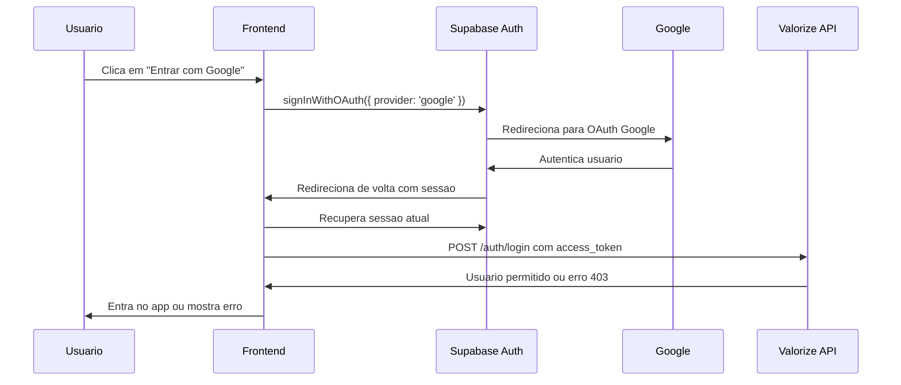

# Guia Objetivo: Login com Google + Supabase no Frontend

## Objetivo

Depois que o usuário fizer login com Google via Supabase, o frontend precisa:

1. receber a sessão criada pelo Supabase
2. extrair o `access_token`
3. enviar esse token para `POST /auth/login`
4. usar a resposta da API para concluir o login no app

Sem isso, o usuário autentica no Google/Supabase, mas o seu backend nunca valida se ele existe na base do Valorize.

---

## Fluxo correto



---

## 1. Configurar o redirect do OAuth

No login com Google, use `redirectTo` apontando para uma rota do frontend que trate o callback.

Exemplo:

```ts
await supabase.auth.signInWithOAuth({
  provider: 'google',
  options: {
    redirectTo: 'http://localhost:3000/auth/callback',
  },
})
```

Em produção, use a URL real do frontend, por exemplo:

```ts
redirectTo: 'https://app.seudominio.com/auth/callback'
```

---

## 2. Criar uma página de callback

Crie uma rota como:

```txt
/auth/callback
```

Essa página deve:

1. esperar o Supabase restaurar a sessão
2. pegar `access_token` e `refresh_token`
3. chamar sua API
4. redirecionar o usuário para dentro do app ou de volta ao login com erro

---

## 3. Na página de callback, recuperar a sessão

Exemplo:

```ts
import { supabase } from './supabaseClient'

async function handleAuthCallback() {
  const { data, error } = await supabase.auth.getSession()

  if (error || !data.session) {
    throw new Error('Sessao do Supabase nao encontrada')
  }

  const { access_token, refresh_token } = data.session

  return { access_token, refresh_token }
}
```

---

## 4. Enviar o token para o backend

Depois de obter a sessão, envie para seu endpoint:

```ts
async function loginWithBackend(access_token: string, refresh_token?: string) {
  const response = await fetch('http://localhost:3001/auth/login', {
    method: 'POST',
    headers: {
      'Content-Type': 'application/json',
    },
    body: JSON.stringify({
      access_token,
      refresh_token,
    }),
  })

  const result = await response.json()

  if (!response.ok) {
    throw new Error(result.message || 'Falha ao autenticar no backend')
  }

  return result.data
}
```

---

## 5. Salvar a sessão da aplicação

Se o backend retornar sucesso, salve os dados necessários no frontend.

Exemplo:

```ts
const backendLogin = await loginWithBackend(access_token, refresh_token)

// Exemplo do que costuma ser salvo
localStorage.setItem('access_token', backendLogin.access_token)

if (backendLogin.refresh_token) {
  localStorage.setItem('refresh_token', backendLogin.refresh_token)
}

localStorage.setItem('user', JSON.stringify(backendLogin.user_info))
```

Depois redirecione:

```ts
window.location.href = '/dashboard'
```

---

## 6. Tratar o caso de usuário não provisionado

Seu backend agora retorna erro se o usuário existir no Supabase mas não existir na base do Valorize.

Então no frontend trate isso claramente:

```ts
try {
  const { access_token, refresh_token } = await handleAuthCallback()
  await loginWithBackend(access_token, refresh_token)
  window.location.href = '/dashboard'
} catch (error) {
  await supabase.auth.signOut()
  window.location.href = '/login?error=google_not_allowed'
}
```

Mensagem sugerida na tela de login:

```txt
Sua conta Google foi autenticada, mas nao esta habilitada para acessar o Valorize.
Entre em contato com o administrador da sua empresa.
```

---

## 7. Exemplo completo da página de callback

```ts
import { useEffect } from 'react'
import { supabase } from './supabaseClient'

export function AuthCallbackPage() {
  useEffect(() => {
    async function run() {
      try {
        const { data, error } = await supabase.auth.getSession()

        if (error || !data.session) {
          throw new Error('Sessao do Supabase nao encontrada')
        }

        const response = await fetch('http://localhost:3001/auth/login', {
          method: 'POST',
          headers: {
            'Content-Type': 'application/json',
          },
          body: JSON.stringify({
            access_token: data.session.access_token,
            refresh_token: data.session.refresh_token,
          }),
        })

        const result = await response.json()

        if (!response.ok) {
          throw new Error(result.message || 'Falha no login')
        }

        localStorage.setItem('access_token', result.data.access_token)

        if (result.data.refresh_token) {
          localStorage.setItem('refresh_token', result.data.refresh_token)
        }

        localStorage.setItem('user', JSON.stringify(result.data.user_info))

        window.location.href = '/dashboard'
      } catch (_error) {
        await supabase.auth.signOut()
        window.location.href = '/login?error=google_not_allowed'
      }
    }

    run()
  }, [])

  return <p>Entrando...</p>
}
```

---

## 8. Erro mais comum no seu cenário

Se hoje ele volta para a página de login “sem resposta”, normalmente é um destes problemas:

1. o frontend não tem uma rota `/auth/callback`
2. o `redirectTo` está apontando para a página errada
3. a página de callback não chama `supabase.auth.getSession()`
4. a página de callback não envia o `access_token` para o backend
5. o backend responde `403` e o frontend ignora esse erro
6. a URL de callback não foi cadastrada no painel do Supabase

---

## 9. Checklist rápido

- Criar rota `/auth/callback`
- Configurar `signInWithOAuth` com `redirectTo`
- Após callback, chamar `supabase.auth.getSession()`
- Enviar `access_token` para `POST /auth/login`
- Se sucesso, salvar sessão local e redirecionar
- Se erro, fazer `supabase.auth.signOut()` e voltar ao login com mensagem
- Garantir que a URL de callback está cadastrada no Supabase

---

## 10. O que o botão de login deve fazer

```ts
await supabase.auth.signInWithOAuth({
  provider: 'google',
  options: {
    redirectTo: 'http://localhost:3000/auth/callback',
  },
})
```

Ele não deve tentar finalizar o login na mesma tela após o clique. A finalização acontece na página de callback.

Se quiser, eu posso escrever esse guia já adaptado para o seu stack do frontend, por exemplo `Next.js`, `React Router`, `Vue` ou `Vite React`.